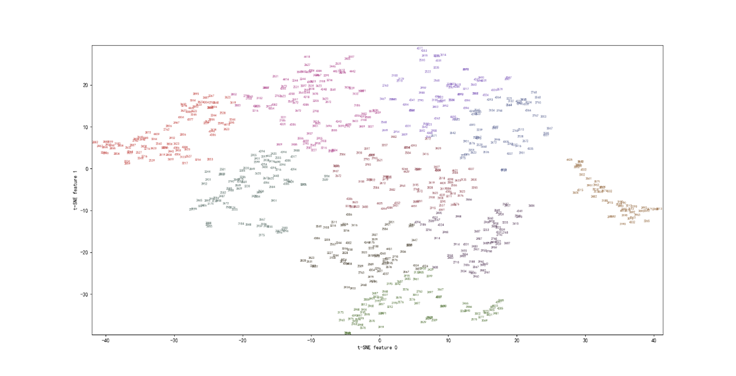

[toc]

## 2020.2.1-2020.2.10

**一、目前处理的可以直接用的数据（pkl存储）：**

1. 学期-方案计划号-学号的嵌套字典

2. 学号-方案计划号字典

**二、专业和根据借书种类对学生聚类的关系**

1.专业使用的是方案计划号（200+个）

2.借书种类A-Z（26）种，首先对于每一个人构建26维的向量

3.用tSNE降维,降至2维

4.kMeans聚类，聚成10类

5.可视化：颜色代表一类，然后每一个点是一个学生，数字表示他们对应的方案计划号

 

主要是看根据借书种类分类下的学生和其实际的专业是否一致，因为没有进行太多轮的调参或分类算法的改进，而且10类和200多个专业相比还是比较小的（下一步可能人工把200个专业考虑细分为大类），所以看到的效果不太好。

能看到比较明显的一处是右侧的3190方案计划号密度是比较大的（3190我后续处理知道是法学专业）

​	TODO:交互界面 JS

## 2020.2.10-2020.2.23

一、ARIMA分析

主要是对时间序列做了ARIMA预测

TODO:预测值是负数，不太好做

## 2020.2.29

获取了学校的校历：

14-15秋 2014-08-31 2015-01-17
14-15春 2015-03-01 2015-07-18
15-16秋 2015-09-06 2016-01-23
15-16春 2016-02-28 2016-07-16
16-17秋 2016-09-04 2017-01-14
16-17春 2017-02-26 2017-07-15
17-18秋 2017-09-03 2018-01-20
17-18春 2018-03-04 2018-07-21
18-19秋 2018-09-02 2019-01-19
18-19春 2019-02-24 2019-07-13

## 2020.3.1

**一、配置D3.js环境**

1.index.html

2.package.json 设置

3.执行npm install

执行npminstall可以自动触发NPM去下载你工程中所引用的所有依赖，包括递归的下载依赖的依赖。所有的依赖库文件会被下载到node_modules文件夹中，该文件夹位于工程文件夹中的根目录里。这些完成以后，就可以创建一个HTML文件（跟我们之前创建的那个一样），HTML文件直接从node_modules/d3/d3.js来引用D3的JavaScript库。

4.安装http-server模块

>npm install http-server –g

5.启动服务器

> http-server .

该命令可以启动一个Node.js驱动的HTTP服务器，默认端口号是8080，也可以用-p参数指定一个端口号。

**二、看了读取json等的例子**

有初步的想法了！

----

## 2020.3.2

1.调试D3例子的源码，并学习了一些语法

function(d,i) : 变量d，i在无名函数中是可用变量。第一个参数d表示这个元素的数据绑定，它的值就是与当前元素关联的数据的值，第二个参数i指当前元素在整个选集中的索引值。 i是从0开始的，每次迭代依次增加1。这两个变量是由D3.js提供的，除此之外还有一个隐含的参数this，this指向当前DOM元素的引用。